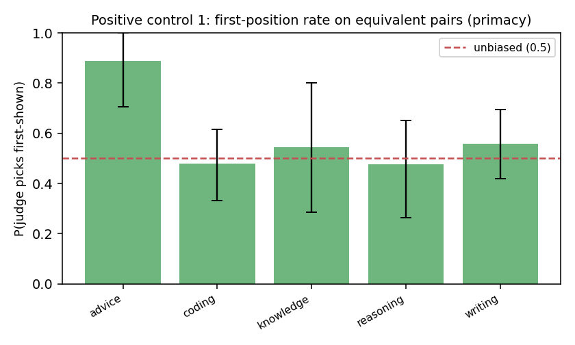
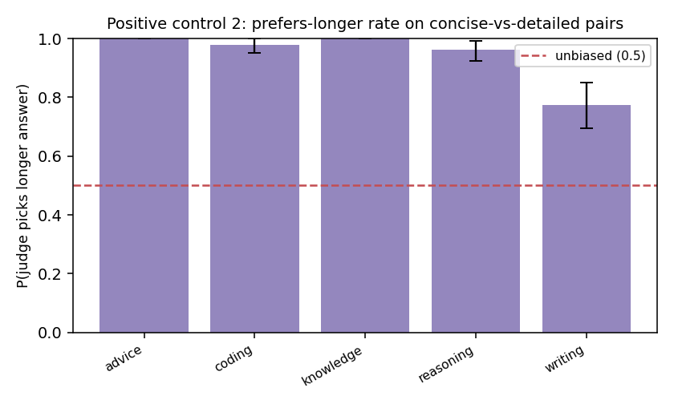

<h1 align="center">Auditing the LLM-as-Judge</h1>
<p align="center"><em>Paired synthetic controls that calibrate the judge before you trust its verdicts.</em></p>

<p align="center">
  
  
  
  
</p>

---

Modern benchmarks increasingly are an LLM judge. We trust that judge to rank
answers — but who calibrates the judge? A judge that silently invents preferences where
none exist, or quietly prefers whichever answer is shown first (or simply the longer
one), corrupts every leaderboard built on top of it.

The fix isn't another accuracy score for the judge. It's a **calibration record on the
very data it judges**: evidence that the judge does *not* manufacture a winner under a
known null, and *does* reveal a known bias when one is injected. That is exactly the
structure of **paired synthetic controls** — negative-outcome controls + simulation-based
calibration — here pointed at a judge instead of a hiring audit.

> **TL;DR** — Build pairs where the truth is known, run them through the judge in both
> orders and at two lengths, and report a one-page **Judge Trustworthiness Report** with
> bootstrap CIs and FDR correction. A judge "passes" only if it stays calibrated on the
> nulls *and* surfaces the planted biases.

## Results on a real judge — DeepSeek-V4-Flash

Audit of **DeepSeek-V4-Flash as a pairwise judge** (served via the `deepseek-chat`
endpoint) over **1,002 pairs** (334 questions × 3
pair types × both orders = 2,004 judge calls). Full record:
[`docs/real/judge_trust_report.md`](docs/real/judge_trust_report.md);
reproduce from committed verdicts with
`python src/report.py docs/real/verdicts.jsonl --outdir docs/real`.

<p align="center">
  
  
</p>

| Metric | Value (95% CI) | Verdict |
|---|---|---|
| Negative — spurious decisive rate | **0.150** [0.117, 0.183] | ✅ ties most equivalent pairs |
| Negative — content-side skew | **0.510** [0.396, 0.622] | ✅ no side preference (CI covers 0.5) |
| Positive #1 — first-position rate | **0.550** [0.471, 0.629] | ✅ no primacy bias (CI covers 0.5) |
| Positive #2 — prefers-longer rate | **0.940** [0.918, 0.958] | ⚠️ strong **length bias** — favors the longer/more-detailed answer |
| Discrimination (sanity) | **0.987** [0.973, 0.997] | ✅ reliably picks the better answer |
| BH-FDR significant | **5 / 15** tests | the length axis fires on all 5 tasks |

**Read it:** DeepSeek-V4-Flash is well-calibrated where it matters — it doesn't manufacture
preferences on equivalent pairs (negative control), shows no position bias (CI covers
0.5), and discriminates quality almost perfectly (0.987). The clear failure is **length
bias**: shown a concise and a more-detailed answer to the same question — both asked to
be correct and complete — it picks the longer one **94%** of the time, FDR-significant on
all five task families. This is the textbook LLM-judge length bias; part of it may be a
legitimate preference for thoroughness, but the magnitude (up to 100% on some tasks) is
exactly the signal a leaderboard built on this judge would silently inherit.

> ⚠️ **This number is a fix, not the first result.** The first version of the length probe
> built the long answer as `concise + boilerplate filler`, which a competent judge correctly
> rejects every time → a degenerate `0.000 [0.000, 0.000]` that BH-FDR then mislabeled
> "significant." The audit's own machinery flagged it: a rate pinned *exactly* at 0 with a
> *zero-width* CI yet called significant is a pipeline-artifact fingerprint, not a real
> finding. See [Fix log](#fix-log-a-bug-the-audit-caught-on-itself).

> *Prefer a no-API-key demo?* A synthetic judge with planted biases lives under
> [`docs/sample/`](docs/sample/) — regenerate with `python scripts/make_sample.py`.

## The idea in one table

| Fairness audit (the source method) | This project (LLM-judge audit) |
|---|---|
| Negative control `Y_clean` — strip the real effect | **Equivalent answer pairs** — two samples of the *same* model on the same question (no true quality gap) |
| *"the audit must not invent disparities"* | the judge must not invent a preference → **spurious-decisive rate** + **content-side skew** |
| Positive control `Y_inject` — plant a known effect θ | **Inject known biases** — show every pair in both orders, and at two lengths |
| *"the audit must recover θ at advertised coverage"* | **first-position rate** (primacy) and **prefers-longer rate** (length); 0.5 = unbiased |
| Verdict is a Monte-Carlo *distribution*, not a token | **Bootstrap 95% CIs** on every rate (cluster-bootstrap over pairs) |
| BH-FDR across many groups | **BH-FDR** across many tasks × bias dimensions |
| Six-line validation record | one-page **`judge_trust_report.md`** |

Two injected-bias axes ship today — **position** (order swap) and **verbosity** (concise
vs. a separately generated detailed answer) — and they're orthogonal because every pair
is shown in both orders. The same machinery extends to self-preference or formatting bias
by swapping the perturbation.

## What's here

```
audit-the-judge/
  configs/    eval_judge_min.py        # learn the OpenCompass judge data-flow (smoke)
              eval_pairwise_audit.py   # run our pairs through the judge inside OpenCompass
  data/       questions.jsonl          # ~40 seed questions across 5 task types
              build_pairs.py           # -> pairs.jsonl  (null + strong/weak + verbose, both orders)
  src/        run_judge.py             # OpenAI-compatible pairwise judge (resumable)
              parse_outputs.py         # OC results OR judge dump -> one tidy verdict table
              negative_control.py      # spurious-preference rate on equivalent pairs
              position_bias.py         # first-position + flip rate (primacy axis)
              verbosity_bias.py        # prefers-longer rate (length axis)
              stats.py                 # bootstrap CIs + BH-FDR
              report.py                # figures + the one-page report
  tests/      test_audit.py            # plants known biases, asserts the audit recovers them
  scripts/    setup_env.sh  run_smoke.sh  run_audit.sh  make_sample.py
  docs/sample/                         # committed synthetic example output
```

**Decoupled from OpenCompass internals.** `parse_outputs.py` normalizes either an
OpenCompass results dir *or* the `run_judge.py` dump into a single schema
`(pair_id, task, pair_type, true_label, order, verdict_slot, winner)`. Every statistic
reads that schema, so the analysis is stable as OpenCompass's output format changes
across versions. `run_judge.py` is the tested path for the statistics; OpenCompass is
used to learn the harness and cross-check the judge.

## Quickstart

Any OpenAI-compatible endpoint works as the judge (DeepSeek, OpenAI, a local vLLM
server, …); DeepSeek is the cheap default.

```bash
# 0. environment  (installs Miniconda if absent, clones OpenCompass, installs everything)
bash scripts/setup_env.sh && conda activate oc
cp .env.example .env        # fill in OC_JUDGE_MODEL / OC_JUDGE_API_KEY / OC_JUDGE_API_BASE
source .env

# 1-2. learn the OpenCompass LLM-judge data flow (one tiny eval)
bash scripts/run_smoke.sh   # -> outputs/judge_min/<ts>/{summary/*.csv, results/**/*.json}

# 3-7. the audit: build pairs -> judge -> controls + bootstrap + FDR -> report
bash scripts/run_audit.sh                 # ~40 questions
#   N=20 bash scripts/run_audit.sh        # quick
#   OFFLINE=1 bash scripts/run_audit.sh   # no API key: fabricated answers (plumbing test)
```

Outputs land in `outputs/judge_trust_report.md` and `outputs/figures/`.

### Verify the tooling without an API key

```bash
python tests/test_audit.py
```

Plants a 70% primacy bias and a 75% length bias into synthetic verdict streams and
asserts the audit flags each (CI excludes 0.5, BH-FDR significant), then plants a
calibrated judge and asserts it passes cleanly — the positive-control sanity check
applied to the tooling itself.

## The validation record

`run_audit.sh` produces a seven-line record (the LLM-judge analogue of the paper's record):

| # | Metric | Reads as |
|---|---|---|
| 1 | Negative — spurious decisive rate | how often the judge picks a winner on equivalent pairs (lower = better) |
| 2 | Negative — content-side skew | P(picks answer-1 \| decisive); 0.5 = no systematic side preference |
| 3 | Positive #1 — first-position rate | 0.5 = no primacy bias; >0.5 = favors the first-shown answer |
| 4 | Positive #1 — order-flip rate | how often the verdict flips under a pure order swap |
| 5 | Positive #2 — prefers-longer rate | 0.5 = no length bias; >0.5 = favors the longer of two content-equal answers |
| 6 | Discrimination (sanity) | picks the strong answer on strong-vs-weak pairs (guards against an "always tie" judge) |
| 7 | BH-FDR significant biases | per-task × per-axis biases surviving multiplicity correction |

## Fix log: a bug the audit caught on itself

The length probe shipped broken the first time, and the framework's own output is what
exposed it — worth keeping as a worked example of why the controls are distributional.

- **The bug.** The "long" answer was built as `concise_answer + boilerplate filler`.
  That isn't a content-equivalent length contrast; it's a literal superset with obvious
  padding. A competent judge (further told to *ignore length*) correctly preferred the
  un-padded answer **every single time**.
- **The false finding it produced.** `prefers-longer` came out **exactly 0.000 on all
  five tasks (0/27, 0/35, 0/64, …)** with a **zero-width CI**, and BH-FDR then stamped it
  "significant" — because 0 is far from 0.5, the binomial p-value is tiny. Read naively,
  the report "significantly" announced a length bias that was 100% a pipeline artifact.
- **How the audit flagged its own bug.** A real behavioral rate is never *exactly* 0 on
  every task with no spread — you'd see 0.3/0.4 with a CI that has width. A proportion
  pinned at a boundary with a zero-width CI *yet called significant* is the fingerprint of
  a mis-constructed metric, not a real effect. The bootstrap + FDR combination is what
  made that fingerprint visible.
- **The fix.** Generate two genuinely content-equivalent answers — a concise one and a
  detailed one (both asked to be correct and complete) — instead of `concise + filler`,
  and re-judge just the verbosity slice (~668 calls, thanks to the resumable runner). The
  honest result flipped to **0.940**: a real, well-estimated length bias.
- **Caveat that remains.** "Longer" and "more thorough" are correlated, so part of the
  0.940 is a legitimate preference for detail; the probe measures *prefers-longer*, not
  *prefers-fluff*. That nuance is the kind of thing a validation record should state
  out loud rather than bury.

## Scope & honesty

- **What it checks:** calibration of the judge's *pairwise verdicts* on the realized
  comparison set — specificity (no invented preferences) and recovery of known biases.
- **What it does not check:** not a construct-validity or adversarial-robustness proof. A
  judge gamed to hide a bias on an axis we didn't probe can still pass — the controls
  raise the floor, they don't certify the ceiling (same caveat as the source method).
- **Extending the positive control:** position and verbosity ship today; the same
  both-orders machinery extends to self-preference or markdown-formatting bias.

## Credit

Method adapted from *"Auditing the Auditor: Paired Synthetic Controls for Calibrating
Fairness Audits"* (negative-outcome controls; simulation-based calibration). Harness:
[OpenCompass](https://github.com/open-compass/opencompass). Licensed MIT.
