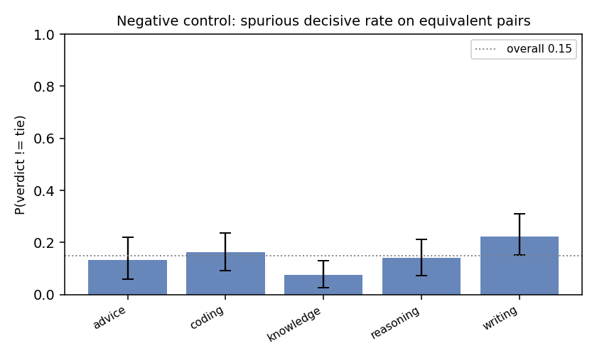

# Judge Trustworthiness Report

**Judge model:** `DeepSeek-V4-Flash (deepseek-chat endpoint), 1002 pairs`  |  **Bootstrap draws:** 2000  |  **Pairs:** 1002

Auditing the LLM-as-judge with paired synthetic controls — the
*"audit the auditor"* method, ported from fairness audits to LLM evaluation.

## Validation record

| # | Metric | Value (95% CI) | Reads as |
|---|--------|----------------|----------|
| 1 | Negative control — spurious decisive rate | 0.150 [0.117, 0.183] | judge invents a winner on equivalent pairs this often (lower = better) |
| 2 | Negative control — content-side skew | 0.510 [0.396, 0.622] | P(picks ans1 \| decisive); 0.5 = no systematic side preference |
| 3 | Positive #1 — first-position rate | 0.550 [0.471, 0.629] | 0.5 = no primacy bias; >0.5 = favors the first-shown answer |
| 4 | Positive #1 — order-flip rate | 0.134 [0.114, 0.155] | verdict changes under a pure order swap this often |
| 5 | Positive #2 — prefers-longer rate | 0.940 [0.918, 0.958] | 0.5 = no length bias; >0.5 = favors the longer answer on content-equal pairs |
| 6 | Discrimination (sanity) | 0.987 [0.973, 0.997] | picks the strong answer on strong-vs-weak pairs (should be high) |
| 7 | BH-FDR significant biases | 5 of 15 tests | tasks/dimensions flagged after multiplicity correction |

## FDR table (Benjamini–Hochberg, two-sided binomial vs the null)

| label                          |   k |   n |   rate |   p_null |   p_raw |   q_bh | sig_fdr   |
|:-------------------------------|----:|----:|-------:|---------:|--------:|-------:|:----------|
| neg::advice::side_skew         |   5 |   9 |  0.556 |    0.500 |   1.000 |  1.000 | False     |
| neg::coding::side_skew         |  14 |  25 |  0.560 |    0.500 |   0.690 |  1.000 | False     |
| neg::knowledge::side_skew      |   3 |  11 |  0.273 |    0.500 |   0.227 |  0.485 | False     |
| neg::reasoning::side_skew      |  13 |  21 |  0.619 |    0.500 |   0.383 |  0.719 | False     |
| neg::writing::side_skew        |  16 |  34 |  0.471 |    0.500 |   0.864 |  1.000 | False     |
| pos::advice::first_position    |   8 |   9 |  0.889 |    0.500 |   0.039 |  0.098 | False     |
| pos::coding::first_position    |  12 |  25 |  0.480 |    0.500 |   1.000 |  1.000 | False     |
| pos::knowledge::first_position |   6 |  11 |  0.545 |    0.500 |   1.000 |  1.000 | False     |
| pos::reasoning::first_position |  10 |  21 |  0.476 |    0.500 |   1.000 |  1.000 | False     |
| pos::writing::first_position   |  19 |  34 |  0.559 |    0.500 |   0.608 |  1.000 | False     |
| len::advice::picks_longer      |  68 |  68 |  1.000 |    0.500 |   0.000 |  0.000 | True      |
| len::coding::picks_longer      | 144 | 147 |  0.980 |    0.500 |   0.000 |  0.000 | True      |
| len::knowledge::picks_longer   | 146 | 146 |  1.000 |    0.500 |   0.000 |  0.000 | True      |
| len::reasoning::picks_longer   | 103 | 107 |  0.963 |    0.500 |   0.000 |  0.000 | True      |
| len::writing::picks_longer     |  99 | 128 |  0.773 |    0.500 |   0.000 |  0.000 | True      |

## How to read this

- **Negative control (1–2)** = the paper's `Y_clean`: on pairs with no true quality
  difference, a calibrated judge should mostly tie with no systematic side preference.
  A high decisive rate or a side-skew CI excluding 0.5 means the judge *manufactures*
  preferences.
- **Positive controls (3–5)** inject *known* biases — presentation order and answer
  length. An unbiased judge is invariant to both: first-position rate ≈ 0.5, low flip
  rate, prefers-longer rate ≈ 0.5. A CI that excludes 0.5 is the audit *recovering a
  known bias*, exactly as `Y_inject` recovers a planted effect. The two axes are
  orthogonal (each pair is shown in both orders).
- **Discrimination (6)** guards against a degenerate "always tie" judge: it must still
  pick the better answer when one genuinely is better.
- **FDR (7)** controls false discoveries across the many per-task tests.

The verdict is a *distribution* (every line carries a bootstrap CI), not a single token.
