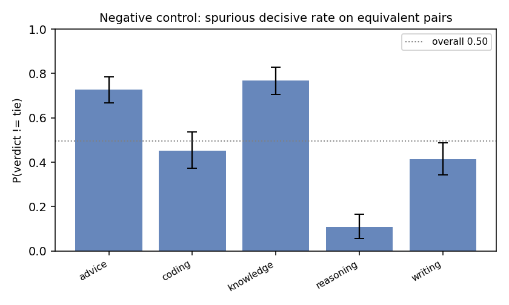
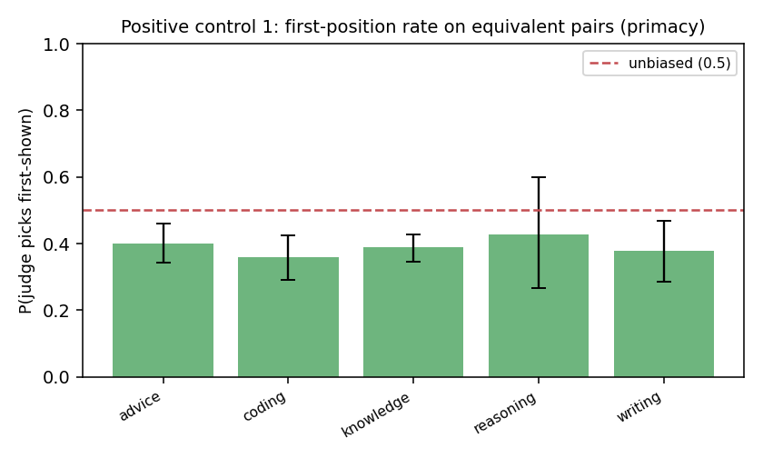
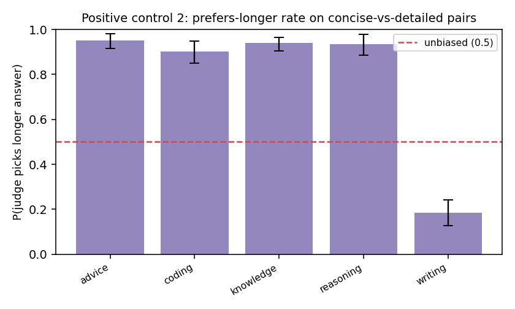

# Judge Trustworthiness Report

**Judge model:** `claude-sonnet-5`  |  **Bootstrap draws:** 1000  |  **Pairs:** 1492

Auditing the LLM-as-judge with paired synthetic controls — the
*"audit the auditor"* method, ported from fairness audits to LLM evaluation.

## Validation record

| # | Metric | Value (95% CI) | Reads as |
|---|--------|----------------|----------|
| 1 | Negative control — spurious decisive rate | 0.496 [0.460, 0.534] | judge invents a winner on equivalent pairs this often (lower = better) |
| 2 | Negative control — content-side skew | 0.485 [0.432, 0.539] | P(picks ans1 \| decisive); 0.5 = no systematic side preference |
| 3 | Positive #1 — first-position rate | 0.387 [0.358, 0.415] | 0.5 = no primacy bias; >0.5 = favors the first-shown answer |
| 4 | Positive #1 — order-flip rate | 0.171 [0.152, 0.189] | verdict changes under a pure order swap this often |
| 5 | Positive #2 — prefers-longer rate | 0.779 [0.744, 0.811] | 0.5 = no length bias; >0.5 = favors the longer answer on content-equal pairs |
| 6 | Discrimination (sanity) | 0.981 [0.967, 0.991] | picks the strong answer on strong-vs-weak pairs (should be high) |
| 7 | BH-FDR significant biases | 8 of 15 tests | tasks/dimensions flagged after multiplicity correction |

## FDR table (Benjamini–Hochberg, two-sided binomial vs the null)

| label                          |   k |   n |   rate |   p_null |   p_raw |   q_bh | sig_fdr   |
|:-------------------------------|----:|----:|-------:|---------:|--------:|-------:|:----------|
| neg::advice::side_skew         |  68 | 145 |  0.469 |    0.500 |   0.507 |  0.656 | False     |
| neg::coding::side_skew         |  48 |  89 |  0.539 |    0.500 |   0.525 |  0.656 | False     |
| neg::knowledge::side_skew      |  74 | 152 |  0.487 |    0.500 |   0.808 |  0.866 | False     |
| neg::reasoning::side_skew      |  10 |  21 |  0.476 |    0.500 |   1.000 |  1.000 | False     |
| neg::writing::side_skew        |  37 |  82 |  0.451 |    0.500 |   0.440 |  0.656 | False     |
| pos::advice::first_position    |  58 | 145 |  0.400 |    0.500 |   0.020 |  0.037 | True      |
| pos::coding::first_position    |  32 |  89 |  0.360 |    0.500 |   0.011 |  0.023 | True      |
| pos::knowledge::first_position |  59 | 152 |  0.388 |    0.500 |   0.007 |  0.018 | True      |
| pos::reasoning::first_position |   9 |  21 |  0.429 |    0.500 |   0.664 |  0.766 | False     |
| pos::writing::first_position   |  31 |  82 |  0.378 |    0.500 |   0.035 |  0.059 | False     |
| len::advice::picks_longer      | 189 | 199 |  0.950 |    0.500 |   0.000 |  0.000 | True      |
| len::coding::picks_longer      | 174 | 193 |  0.902 |    0.500 |   0.000 |  0.000 | True      |
| len::knowledge::picks_longer   | 187 | 199 |  0.940 |    0.500 |   0.000 |  0.000 | True      |
| len::reasoning::picks_longer   | 159 | 170 |  0.935 |    0.500 |   0.000 |  0.000 | True      |
| len::writing::picks_longer     |  36 | 195 |  0.185 |    0.500 |   0.000 |  0.000 | True      |

## How to read this

- **Negative control (1–2)** = the paper's `Y_clean`: on pairs with no true quality
  difference, a calibrated judge should mostly tie with no systematic side preference.
  A high decisive rate or a side-skew CI excluding 0.5 means the judge *manufactures*
  preferences.
- **Positive controls (3–5)** inject *known* biases — presentation order and answer
  length. An unbiased judge is invariant to both: first-position rate ≈ 0.5, low flip
  rate, prefers-longer rate ≈ 0.5. A CI that excludes 0.5 is the audit *recovering a
  known bias*, exactly as `Y_inject` recovers a planted effect. The two axes are
  orthogonal (each pair is shown in both orders).
- **Discrimination (6)** guards against a degenerate "always tie" judge: it must still
  pick the better answer when one genuinely is better.
- **FDR (7)** controls false discoveries across the many per-task tests.

The verdict is a *distribution* (every line carries a bootstrap CI), not a single token.
