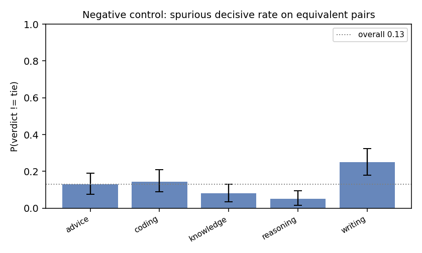
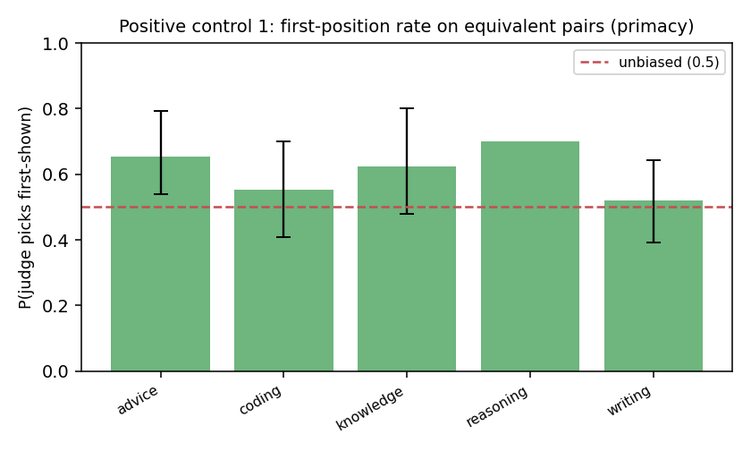
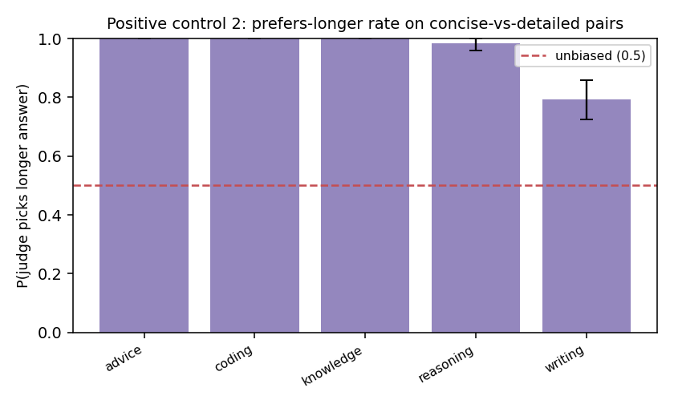

# Judge Trustworthiness Report

**Judge model:** `deepseek-v4`  |  **Bootstrap draws:** 1000  |  **Pairs:** 1500

Auditing the LLM-as-judge with paired synthetic controls — the
*"audit the auditor"* method, ported from fairness audits to LLM evaluation.

## Validation record

| # | Metric | Value (95% CI) | Reads as |
|---|--------|----------------|----------|
| 1 | Negative control — spurious decisive rate | 0.131 [0.107, 0.158] | judge invents a winner on equivalent pairs this often (lower = better) |
| 2 | Negative control — content-side skew | 0.534 [0.427, 0.638] | P(picks ans1 \| decisive); 0.5 = no systematic side preference |
| 3 | Positive #1 — first-position rate | 0.580 [0.508, 0.648] | 0.5 = no primacy bias; >0.5 = favors the first-shown answer |
| 4 | Positive #1 — order-flip rate | 0.110 [0.095, 0.126] | verdict changes under a pure order swap this often |
| 5 | Positive #2 — prefers-longer rate | 0.961 [0.946, 0.973] | 0.5 = no length bias; >0.5 = favors the longer answer on content-equal pairs |
| 6 | Discrimination (sanity) | 0.995 [0.988, 1.000] | picks the strong answer on strong-vs-weak pairs (should be high) |
| 7 | BH-FDR significant biases | 5 of 15 tests | tasks/dimensions flagged after multiplicity correction |

## FDR table (Benjamini–Hochberg, two-sided binomial vs the null)

| label                          |   k |   n |   rate |   p_null |   p_raw |   q_bh | sig_fdr   |
|:-------------------------------|----:|----:|-------:|---------:|--------:|-------:|:----------|
| neg::advice::side_skew         |  11 |  26 |  0.423 |    0.500 |   0.557 |  0.760 | False     |
| neg::coding::side_skew         |  18 |  29 |  0.621 |    0.500 |   0.265 |  0.568 | False     |
| neg::knowledge::side_skew      |  10 |  16 |  0.625 |    0.500 |   0.454 |  0.682 | False     |
| neg::reasoning::side_skew      |   5 |  10 |  0.500 |    0.500 |   1.000 |  1.000 | False     |
| neg::writing::side_skew        |  26 |  50 |  0.520 |    0.500 |   0.888 |  0.951 | False     |
| pos::advice::first_position    |  17 |  26 |  0.654 |    0.500 |   0.169 |  0.422 | False     |
| pos::coding::first_position    |  16 |  29 |  0.552 |    0.500 |   0.711 |  0.889 | False     |
| pos::knowledge::first_position |  10 |  16 |  0.625 |    0.500 |   0.454 |  0.682 | False     |
| pos::reasoning::first_position |   7 |  10 |  0.700 |    0.500 |   0.344 |  0.645 | False     |
| pos::writing::first_position   |  26 |  50 |  0.520 |    0.500 |   0.888 |  0.951 | False     |
| len::advice::picks_longer      | 199 | 199 |  1.000 |    0.500 |   0.000 |  0.000 | True      |
| len::coding::picks_longer      | 200 | 200 |  1.000 |    0.500 |   0.000 |  0.000 | True      |
| len::knowledge::picks_longer   | 200 | 200 |  1.000 |    0.500 |   0.000 |  0.000 | True      |
| len::reasoning::picks_longer   | 124 | 126 |  0.984 |    0.500 |   0.000 |  0.000 | True      |
| len::writing::picks_longer     | 123 | 155 |  0.794 |    0.500 |   0.000 |  0.000 | True      |

## How to read this

- **Negative control (1–2)** = the paper's `Y_clean`: on pairs with no true quality
  difference, a calibrated judge should mostly tie with no systematic side preference.
  A high decisive rate or a side-skew CI excluding 0.5 means the judge *manufactures*
  preferences.
- **Positive controls (3–5)** inject *known* biases — presentation order and answer
  length. An unbiased judge is invariant to both: first-position rate ≈ 0.5, low flip
  rate, prefers-longer rate ≈ 0.5. A CI that excludes 0.5 is the audit *recovering a
  known bias*, exactly as `Y_inject` recovers a planted effect. The two axes are
  orthogonal (each pair is shown in both orders).
- **Discrimination (6)** guards against a degenerate "always tie" judge: it must still
  pick the better answer when one genuinely is better.
- **FDR (7)** controls false discoveries across the many per-task tests.

The verdict is a *distribution* (every line carries a bootstrap CI), not a single token.
