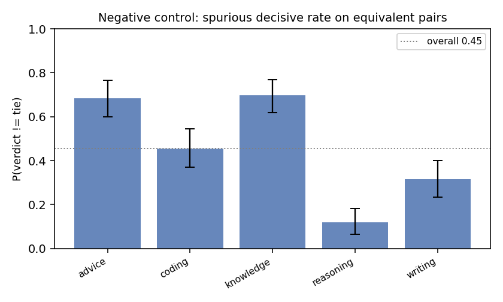
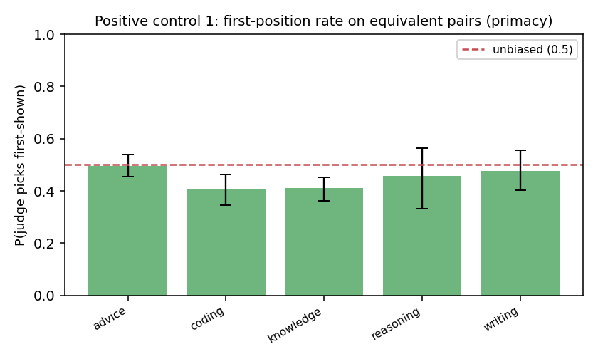
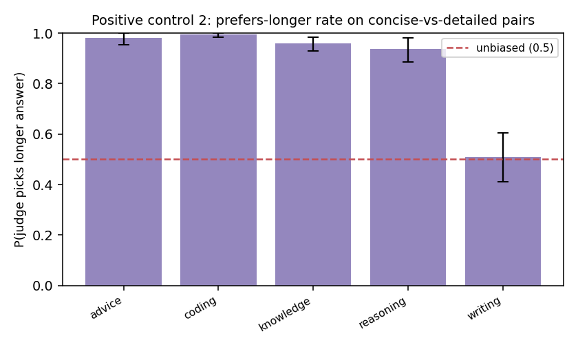

# Judge Trustworthiness Report

**Judge model:** `gemini-3.5-flash`  |  **Bootstrap draws:** 1000  |  **Pairs:** 1500

Auditing the LLM-as-judge with paired synthetic controls — the
*"audit the auditor"* method, ported from fairness audits to LLM evaluation.

## Validation record

| # | Metric | Value (95% CI) | Reads as |
|---|--------|----------------|----------|
| 1 | Negative control — spurious decisive rate | 0.455 [0.416, 0.493] | judge invents a winner on equivalent pairs this often (lower = better) |
| 2 | Negative control — content-side skew | 0.524 [0.466, 0.585] | P(picks ans1 \| decisive); 0.5 = no systematic side preference |
| 3 | Positive #1 — first-position rate | 0.447 [0.421, 0.472] | 0.5 = no primacy bias; >0.5 = favors the first-shown answer |
| 4 | Positive #1 — order-flip rate | 0.105 [0.089, 0.120] | verdict changes under a pure order swap this often |
| 5 | Positive #2 — prefers-longer rate | 0.880 [0.850, 0.905] | 0.5 = no length bias; >0.5 = favors the longer answer on content-equal pairs |
| 6 | Discrimination (sanity) | 0.986 [0.975, 0.994] | picks the strong answer on strong-vs-weak pairs (should be high) |
| 7 | BH-FDR significant biases | 5 of 15 tests | tasks/dimensions flagged after multiplicity correction |

## FDR table (Benjamini–Hochberg, two-sided binomial vs the null)

| label                          |   k |   n |   rate |   p_null |   p_raw |   q_bh | sig_fdr   |
|:-------------------------------|----:|----:|-------:|---------:|--------:|-------:|:----------|
| neg::advice::side_skew         |  69 | 137 |  0.504 |    0.500 |   1.000 |  1.000 | False     |
| neg::coding::side_skew         |  61 |  91 |  0.670 |    0.500 |   0.002 |  0.005 | True      |
| neg::knowledge::side_skew      |  69 | 139 |  0.496 |    0.500 |   1.000 |  1.000 | False     |
| neg::reasoning::side_skew      |  11 |  24 |  0.458 |    0.500 |   0.839 |  1.000 | False     |
| neg::writing::side_skew        |  28 |  63 |  0.444 |    0.500 |   0.450 |  0.844 | False     |
| pos::advice::first_position    |  68 | 137 |  0.496 |    0.500 |   1.000 |  1.000 | False     |
| pos::coding::first_position    |  37 |  91 |  0.407 |    0.500 |   0.093 |  0.199 | False     |
| pos::knowledge::first_position |  57 | 139 |  0.410 |    0.500 |   0.041 |  0.103 | False     |
| pos::reasoning::first_position |  11 |  24 |  0.458 |    0.500 |   0.839 |  1.000 | False     |
| pos::writing::first_position   |  30 |  63 |  0.476 |    0.500 |   0.801 |  1.000 | False     |
| len::advice::picks_longer      | 196 | 200 |  0.980 |    0.500 |   0.000 |  0.000 | True      |
| len::coding::picks_longer      | 199 | 200 |  0.995 |    0.500 |   0.000 |  0.000 | True      |
| len::knowledge::picks_longer   | 192 | 200 |  0.960 |    0.500 |   0.000 |  0.000 | True      |
| len::reasoning::picks_longer   | 138 | 147 |  0.939 |    0.500 |   0.000 |  0.000 | True      |
| len::writing::picks_longer     |  93 | 183 |  0.508 |    0.500 |   0.883 |  1.000 | False     |

## How to read this

- **Negative control (1–2)** = the paper's `Y_clean`: on pairs with no true quality
  difference, a calibrated judge should mostly tie with no systematic side preference.
  A high decisive rate or a side-skew CI excluding 0.5 means the judge *manufactures*
  preferences.
- **Positive controls (3–5)** inject *known* biases — presentation order and answer
  length. An unbiased judge is invariant to both: first-position rate ≈ 0.5, low flip
  rate, prefers-longer rate ≈ 0.5. A CI that excludes 0.5 is the audit *recovering a
  known bias*, exactly as `Y_inject` recovers a planted effect. The two axes are
  orthogonal (each pair is shown in both orders).
- **Discrimination (6)** guards against a degenerate "always tie" judge: it must still
  pick the better answer when one genuinely is better.
- **FDR (7)** controls false discoveries across the many per-task tests.

The verdict is a *distribution* (every line carries a bootstrap CI), not a single token.
