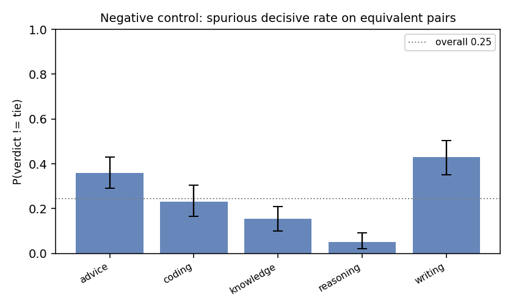
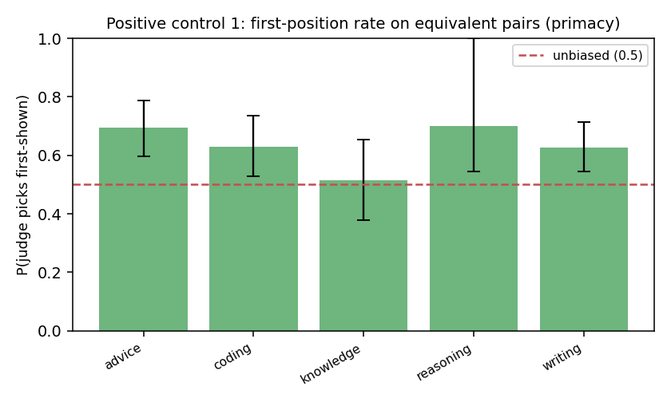
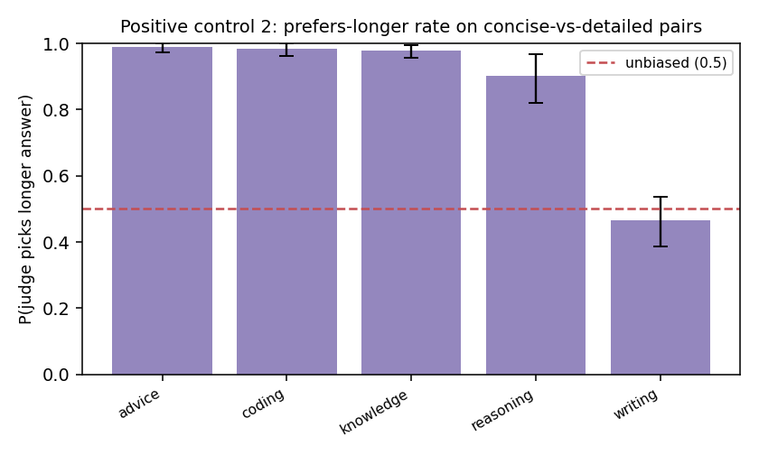

# Judge Trustworthiness Report

**Judge model:** `kimi-k2.6`  |  **Bootstrap draws:** 1000  |  **Pairs:** 1498

Auditing the LLM-as-judge with paired synthetic controls — the
*"audit the auditor"* method, ported from fairness audits to LLM evaluation.

## Validation record

| # | Metric | Value (95% CI) | Reads as |
|---|--------|----------------|----------|
| 1 | Negative control — spurious decisive rate | 0.246 [0.216, 0.278] | judge invents a winner on equivalent pairs this often (lower = better) |
| 2 | Negative control — content-side skew | 0.494 [0.426, 0.563] | P(picks ans1 \| decisive); 0.5 = no systematic side preference |
| 3 | Positive #1 — first-position rate | 0.637 [0.586, 0.688] | 0.5 = no primacy bias; >0.5 = favors the first-shown answer |
| 4 | Positive #1 — order-flip rate | 0.220 [0.199, 0.242] | verdict changes under a pure order swap this often |
| 5 | Positive #2 — prefers-longer rate | 0.876 [0.848, 0.901] | 0.5 = no length bias; >0.5 = favors the longer answer on content-equal pairs |
| 6 | Discrimination (sanity) | 0.986 [0.978, 0.994] | picks the strong answer on strong-vs-weak pairs (should be high) |
| 7 | BH-FDR significant biases | 5 of 15 tests | tasks/dimensions flagged after multiplicity correction |

## FDR table (Benjamini–Hochberg, two-sided binomial vs the null)

| label                          |   k |   n |   rate |   p_null |   p_raw |   q_bh | sig_fdr   |
|:-------------------------------|----:|----:|-------:|---------:|--------:|-------:|:----------|
| neg::advice::side_skew         |  38 |  72 |  0.528 |    0.500 |   0.724 |  0.905 | False     |
| neg::coding::side_skew         |  21 |  46 |  0.457 |    0.500 |   0.659 |  0.898 | False     |
| neg::knowledge::side_skew      |  15 |  31 |  0.484 |    0.500 |   1.000 |  1.000 | False     |
| neg::reasoning::side_skew      |   3 |  10 |  0.300 |    0.500 |   0.344 |  0.573 | False     |
| neg::writing::side_skew        |  44 |  86 |  0.512 |    0.500 |   0.914 |  1.000 | False     |
| pos::advice::first_position    |  50 |  72 |  0.694 |    0.500 |   0.001 |  0.004 | True      |
| pos::coding::first_position    |  29 |  46 |  0.630 |    0.500 |   0.104 |  0.222 | False     |
| pos::knowledge::first_position |  16 |  31 |  0.516 |    0.500 |   1.000 |  1.000 | False     |
| pos::reasoning::first_position |   7 |  10 |  0.700 |    0.500 |   0.344 |  0.573 | False     |
| pos::writing::first_position   |  54 |  86 |  0.628 |    0.500 |   0.023 |  0.057 | False     |
| len::advice::picks_longer      | 189 | 191 |  0.990 |    0.500 |   0.000 |  0.000 | True      |
| len::coding::picks_longer      | 172 | 175 |  0.983 |    0.500 |   0.000 |  0.000 | True      |
| len::knowledge::picks_longer   | 177 | 181 |  0.978 |    0.500 |   0.000 |  0.000 | True      |
| len::reasoning::picks_longer   |  82 |  91 |  0.901 |    0.500 |   0.000 |  0.000 | True      |
| len::writing::picks_longer     |  70 | 150 |  0.467 |    0.500 |   0.463 |  0.694 | False     |

## How to read this

- **Negative control (1–2)** = the paper's `Y_clean`: on pairs with no true quality
  difference, a calibrated judge should mostly tie with no systematic side preference.
  A high decisive rate or a side-skew CI excluding 0.5 means the judge *manufactures*
  preferences.
- **Positive controls (3–5)** inject *known* biases — presentation order and answer
  length. An unbiased judge is invariant to both: first-position rate ≈ 0.5, low flip
  rate, prefers-longer rate ≈ 0.5. A CI that excludes 0.5 is the audit *recovering a
  known bias*, exactly as `Y_inject` recovers a planted effect. The two axes are
  orthogonal (each pair is shown in both orders).
- **Discrimination (6)** guards against a degenerate "always tie" judge: it must still
  pick the better answer when one genuinely is better.
- **FDR (7)** controls false discoveries across the many per-task tests.

The verdict is a *distribution* (every line carries a bootstrap CI), not a single token.
