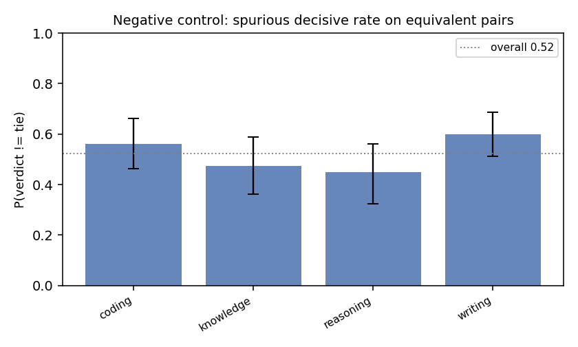
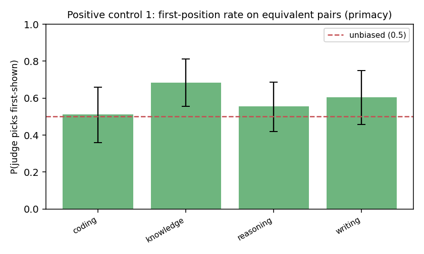
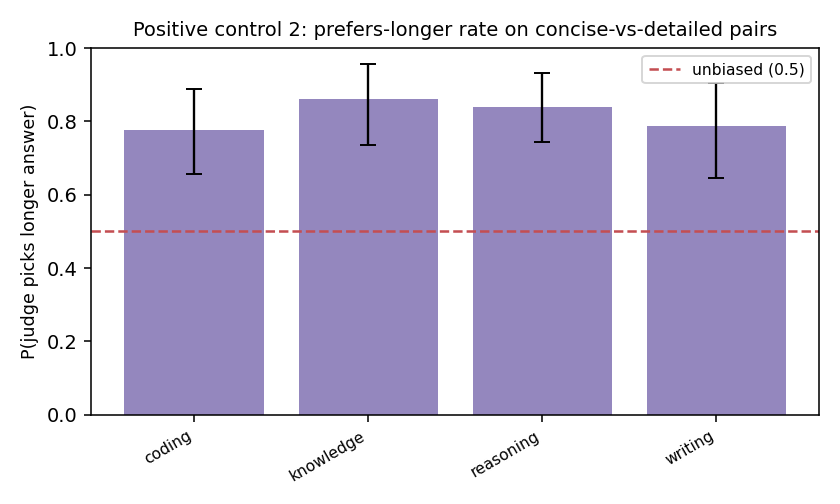

# Judge Trustworthiness Report

**Judge model:** `SYNTHETIC DEMO judge (planted: 0.62 primacy, 0.71 length bias)`  |  **Bootstrap draws:** 2000  |  **Pairs:** 480

Auditing the LLM-as-judge with paired synthetic controls — the
*"audit the auditor"* method, ported from fairness audits to LLM evaluation.

## Validation record

| # | Metric | Value (95% CI) | Reads as |
|---|--------|----------------|----------|
| 1 | Negative control — spurious decisive rate | 0.522 [0.469, 0.575] | judge invents a winner on equivalent pairs this often (lower = better) |
| 2 | Negative control — content-side skew | 0.527 [0.445, 0.603] | P(picks ans1 \| decisive); 0.5 = no systematic side preference |
| 3 | Positive #1 — first-position rate | 0.587 [0.515, 0.661] | 0.5 = no primacy bias; >0.5 = favors the first-shown answer |
| 4 | Positive #1 — order-flip rate | 0.431 [0.388, 0.477] | verdict changes under a pure order swap this often |
| 5 | Positive #2 — prefers-longer rate | 0.816 [0.760, 0.871] | 0.5 = no length bias; >0.5 = favors the longer answer on content-equal pairs |
| 6 | Discrimination (sanity) | 0.956 [0.934, 0.975] | picks the strong answer on strong-vs-weak pairs (should be high) |
| 7 | BH-FDR significant biases | 4 of 12 tests | tasks/dimensions flagged after multiplicity correction |

## FDR table (Benjamini–Hochberg, two-sided binomial vs the null)

| label                          |   k |   n |   rate |   p_null |   p_raw |   q_bh | sig_fdr   |
|:-------------------------------|----:|----:|-------:|---------:|--------:|-------:|:----------|
| neg::coding::side_skew         |  22 |  45 |  0.489 |    0.500 |   1.000 |  1.000 | False     |
| neg::knowledge::side_skew      |  24 |  38 |  0.632 |    0.500 |   0.143 |  0.287 | False     |
| neg::reasoning::side_skew      |  14 |  36 |  0.389 |    0.500 |   0.243 |  0.364 | False     |
| neg::writing::side_skew        |  28 |  48 |  0.583 |    0.500 |   0.312 |  0.416 | False     |
| pos::coding::first_position    |  23 |  45 |  0.511 |    0.500 |   1.000 |  1.000 | False     |
| pos::knowledge::first_position |  26 |  38 |  0.684 |    0.500 |   0.034 |  0.081 | False     |
| pos::reasoning::first_position |  20 |  36 |  0.556 |    0.500 |   0.618 |  0.741 | False     |
| pos::writing::first_position   |  29 |  48 |  0.604 |    0.500 |   0.193 |  0.332 | False     |
| len::coding::picks_longer      |  35 |  45 |  0.778 |    0.500 |   0.000 |  0.001 | True      |
| len::knowledge::picks_longer   |  37 |  43 |  0.860 |    0.500 |   0.000 |  0.000 | True      |
| len::reasoning::picks_longer   |  42 |  50 |  0.840 |    0.500 |   0.000 |  0.000 | True      |
| len::writing::picks_longer     |  37 |  47 |  0.787 |    0.500 |   0.000 |  0.000 | True      |

## How to read this

- **Negative control (1–2)** = the paper's `Y_clean`: on pairs with no true quality
  difference, a calibrated judge should mostly tie with no systematic side preference.
  A high decisive rate or a side-skew CI excluding 0.5 means the judge *manufactures*
  preferences.
- **Positive controls (3–5)** inject *known* biases — presentation order and answer
  length. An unbiased judge is invariant to both: first-position rate ≈ 0.5, low flip
  rate, prefers-longer rate ≈ 0.5. A CI that excludes 0.5 is the audit *recovering a
  known bias*, exactly as `Y_inject` recovers a planted effect. The two axes are
  orthogonal (each pair is shown in both orders).
- **Discrimination (6)** guards against a degenerate "always tie" judge: it must still
  pick the better answer when one genuinely is better.
- **FDR (7)** controls false discoveries across the many per-task tests.

The verdict is a *distribution* (every line carries a bootstrap CI), not a single token.
